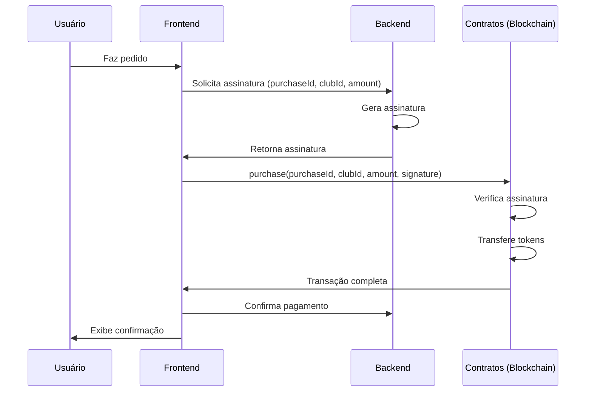

# Integração de Pagamento com Fan Tokens

Este documento descreve a implementação e uso do sistema de pagamento com Fan Tokens na plataforma Fanatique.

## Visão Geral

Fanatique permite que torcedores façam pedidos em estádios usando tokens de fã como forma de pagamento. O fluxo de integração entre o frontend, backend e contratos inteligentes foi implementado para garantir transações seguras e verificáveis.

## Arquitetura

O sistema de pagamento é composto por:

1. **Contratos Inteligentes**:
   - `FanToken.sol`: Gerencia tokens de fã para diferentes clubes
   - `Payment.sol`: Processa pagamentos usando tokens de fã
   - `Fanatique.sol`: Contrato principal que integra todas as funcionalidades

2. **Backend**:
   - `payment.service.ts`: Serviço para assinar transações de pagamento
   - `payment.controller.ts`: Controlador para expor endpoints da API
   - `payment.routes.ts`: Rotas da API para operações de pagamento

3. **Frontend** (implementação sugerida):
   - Componentes para conectar carteira Web3
   - Interface para realizar pagamentos com tokens
   - Integração com API do backend para obter assinaturas

## Fluxo de Pagamento

1. O usuário faz um pedido no aplicativo Fanatique
2. O frontend solicita uma assinatura do backend para o pagamento
3. O backend gera uma assinatura usando a chave privada do signer
4. O frontend envia a transação para o contrato Fanatique com a assinatura
5. O contrato verifica a assinatura e processa a transferência de tokens
6. O frontend confirma o sucesso da transação



## API de Pagamento

### Gerar Assinatura

**Endpoint**: `POST /api/payment/signature`

**Request Body**:
```json
{
  "purchaseId": 12345,
  "buyer": "0xabc...",
  "clubId": 1,
  "amount": "50.0"
}
```

**Response**:
```json
{
  "success": true,
  "data": {
    "purchaseId": 12345,
    "buyer": "0xabc...",
    "clubId": 1,
    "amount": "50000000000000000000",
    "contractAddress": "0xdef...",
    "chainId": 88888,
    "signature": "0x123..."
  }
}
```

### Verificar Assinatura

**Endpoint**: `POST /api/payment/verify`

**Request Body**:
```json
{
  "purchaseId": 12345,
  "buyer": "0xabc...",
  "clubId": 1,
  "amount": "50.0",
  "signature": "0x123..."
}
```

**Response**:
```json
{
  "success": true,
  "isValid": true
}
```

## Configuração do Ambiente

### Variáveis de Ambiente

Crie um arquivo `.env` com as seguintes variáveis:

```
SIGNER_PRIVATE_KEY=chave_privada_do_backend
CONTRACT_ADDRESS=endereco_do_contrato_fanatique
CHAIN_ID=id_da_rede_blockchain
```

## Testes

Existem dois métodos para testar o sistema:

1. **Testes Automatizados**: Execute `yarn hardhat test` para executar o cenário de teste em `fanatique.ts`

2. **Script de Teste Manual**: Execute `yarn hardhat run scripts/payment/test-payment.ts` para simular o fluxo completo

## Implementação no Frontend

A implementação no frontend deve seguir os passos descritos em `payment-frontend-example.ts`. O fluxo básico é:

1. Conectar à carteira do usuário (Metamask ou similar)
2. Solicitar assinatura do backend
3. Enviar transação para o contrato com a assinatura
4. Informar o usuário sobre o resultado

## Considerações de Segurança

- A chave privada do signer deve ser mantida segura e nunca exposta
- Verifique sempre se o usuário tem saldo suficiente antes de iniciar o processo
- Garanta que cada `purchaseId` seja único para evitar ataques de replay
- Implemente timeouts para assinaturas para limitar o tempo de validade 